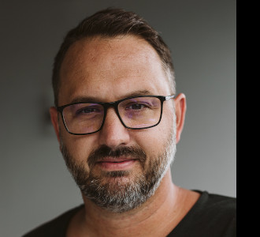
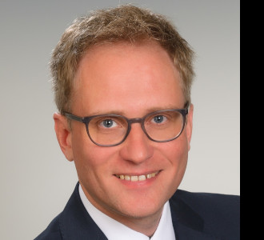
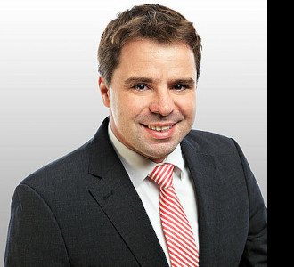
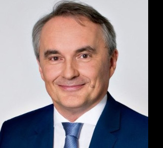
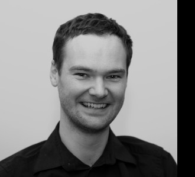
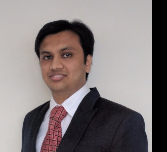

# First International Workshop on Empowering Energy Literacy - HCI Strategies for Accessible Data Engagement (EEL-HCI2024)

## Call for Participation
We invite researchers, practitioners, and experts from diverse disciplines to participate the workshop on Empowering Energy Literacy: HCI Strategies for Accessible Data Engagement (EEL-HCI). In an increasingly complex energy landscape, understanding and interpreting energy data have become paramount for effective decision-making, policy formulation, and technological advancements. This workshop seeks to explore the interdisciplinary dimensions of explainable energy data, encompassing technical, regulatory, societal, political, and security aspects.

Our workshop aims to foster discussions and collaborations on a wide range of topics, including but not limited to:
* Best practices in collecting, processing, and analyzing energy data
* Legal and ethical considerations surrounding the use and sharing of energy data
* Uncovering the complexities behind energy market models and pricing mechanisms
* Exploring user and domain-specific challenges in understanding energy consumption patterns
* Addressing the need for transparency and accountability in energy data interpretation
* Investigating the role of explainable energy data in shaping energy policies and regulations
* Assessing the security implications of data-driven energy systems

Participants will have the opportunity to engage in interactive sessions, share their research findings, exchange ideas, and contribute to shaping the future of explainable energy data. Whether you are a data scientist, policy analyst, energy industry professional, or academic researcher, your insights and expertise are valuable in advancing our collective understanding of this critical domain.

Join us for a stimulating exchange of knowledge and perspectives at the Workshop on Empowering Energy Literacy: HCI Strategies for Accessible Data Engagement (EEL-HCI). Together, let's unravel the complexities and unlock the potential of energy data for a sustainable future.

## Important Dates
* Publication of CfP on Workshop Website: **April 1st, 2024**
* Submission Deadline for Workshop Papers **June 11th, 2024**
* Notifications: **July 9th, 2024**
* Camera-ready Deadline: **July 30th, 2024**
* Workshop: **September 1st, 2024**

All deadlines are AoE.

## Organizers

**Marc Kurz** is a professor for mobile software systems within the Department for Smart and Interconnected Living (SAIL) at the University of Applied Sciences Upper Austria. His current research focus lies at the convergence of (mobile) HCI, artificial intelligence, and energy informatics. He was involved in the organizing committee of MuC'23 and is currently also serving as Co-Chair for the Student Research Competition at MuC'24. 

 

**Oliver Hödl** is a professor at the Department for Smart and Interconnected Living (SAIL) at the University of Applied Sciences Upper Austria. He is also affiliated with the University of Vienna as a lecturer and received his PhD in HCI from the Vienna University of Technology with highest distinction. Oliver acts as the project coordinator of the Horizon Europe project EDDIE - European Distributed Data Infrastructure for Energy.

 

**Georg Hartner** is an Enterprise Architect working for Austrian and European institutions in the energy domain. He is a key contributor to programs to establish European energy service interoperability, member of EU DSO Entity's expert groups and member of the Development Team for the upcoming Network Code on Demand Response. Georg also acts as Technical Coordinator of Project EDDIE.

 

**Christoph Schaffer** serves as the head of the Department for Smart and Interconnected Living (SAIL) at the University of Applied Sciences Upper Austria. His research endeavors center around the integration of computer science and digitalization within the energy sector.

 

**Stefan Grünberger** is a researcher at the University of Applied Sciences Upper Austria. He contributed to various research projects in the fields of NFC/RFID, autonomous driving, safety in industry 4.0 and currently smart energy data spaces. 

 

**Shievam Kashyap** works as a researcher at University of Applied Sciences Upper Austria. Additionally, he is a visiting lecturer for various Energy and IT-related courses. His focus of research includes Smart Grids, Electromobility, Microgrids, Energy sharing, Renewable energy sources etc.

 
