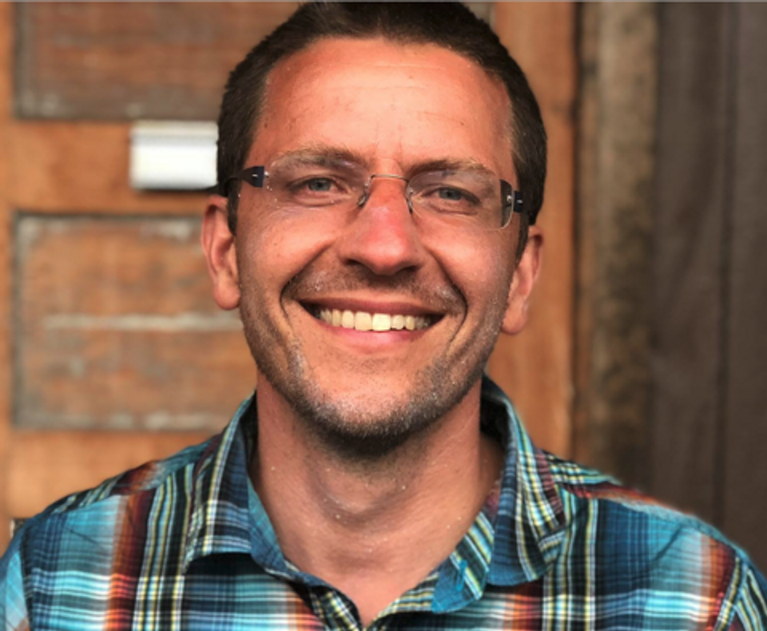

# Third International Workshop on Empowering Energy Literacy - HCI Strategies for Accessible Data Engagement (EEL-HCI2026)

## Call for Participation

In today's dynamic energy transition, effective management and comprehension of energy-related information transcend conventional data analysis, which concerns all stakeholders involved from network operators to citizens. This workshop explores multifaceted energy transparency, integrating best practices, legal considerations, and HCI principles to empower informed action and drive sustainability.

We invite researchers, practitioners, and experts from diverse disciplines to participate in the workshop on **Empowering Energy Literacy: HCI Strategies for Accessible Data Engagement (EEL-HCI)** at <a href="https://muc2026.mensch-und-computer.de" target="_blank" style="text-decoration:underline;">Mensch und Computer 2026</a> in Duisburg, Germany.

Through presentations of position papers, we aim to collect multidisciplinary needs, challenges, requirements, and best practices which will be discussed to conclude on HCI strategies to navigate energy dynamics effectively, unlocking transformative potential for sustainability.

### Topics

Topics include but are not limited to:
* Best practices in collecting, processing, and analyzing energy data
* Legal and ethical considerations surrounding the use and sharing of energy data
* Complexities behind energy market models and pricing mechanisms
* User and domain-specific challenges in understanding energy consumption patterns
* Transparency and accountability in energy data interpretation
* The role of explainable energy data in shaping energy policies and regulations
* Security implications of data-driven energy systems

Participants will engage in interactive sessions, share research findings, and contribute to shaping the future of explainable energy data. Join us for a stimulating exchange of knowledge and perspectives. Together, let's unlock the potential of energy data for a sustainable future.

## Important Dates
* Publication of CfP on Workshop Website: **April 1st, 2026**
* Submission Deadline for Workshop Papers: **June 3rd, 2026**
* Notifications: **July 1st, 2026**
* Camera-ready Deadline: **July 22nd, 2026** (ultimate deadline for inclusion in proceedings)
* Workshop: **August 30th, 2026** (Sunday afternoon)

All deadlines are AoE.

## Submission
We invite submissions of position papers from authors with diverse backgrounds. All submissions must be anonymized and follow the <a href="https://sigchi.org/resources/guides-for-authors/accessibility" target="_blank" style="text-decoration:underline;">SIGCHI Accessibility Guide for Authors</a>. All submissions will be reviewed by two independent reviewers (double blind review).

Please submit your paper via ConfTool: <a href="https://www.conftool.pro/muc2026/index.php?page=submissions#new" target="_blank" style="text-decoration:underline;">https://www.conftool.pro/muc2026/index.php?page=submissions#new</a>

When submitting, please select the track: **"MCI-WS104: Third International Workshop on Empowering Energy Literacy - HCI Strategies for Accessible Data Engagement (EEL-HCI2026)"**.

## Program & Venue
The workshop will be held as part of the <a href="https://muc2026.mensch-und-computer.de" target="_blank" style="text-decoration:underline;">Mensch & Computer 2026 (MuC'26)</a> conference in Duisburg, Germany.

Planned date for the workshop is August 30th, 2026 (Sunday afternoon).

We aim for a half-day workshop (approximately 180 minutes) with the following planned format:

| Time    | Topic |
| -------- | ------- |
| tbd  | Welcome and Introduction (15 min)    |
| tbd | Position Paper Presentations with Q&A (75 min)     |
| tbd    | Break (15 min)    |
| tbd    | Interactive Group Discussion and Clustering of Positions (45 min)    |
| tbd    | Conclusion, Synthesis of Findings, and Next Steps (30 min)    |

## Organizers

<b>Marc Kurz</b> is a professor of mobile software systems at the University of Applied Sciences Upper Austria. His research focuses on the intersection of (mobile) HCI, artificial intelligence, and energy informatics. He was part of the organizing committee of MuC'23 and MuC'24 and co-organized the first two editions of the EEL-HCI workshop.

<b>Oliver Hödl</b> is a professor at the University of Applied Sciences Upper Austria and affiliated with the University of Vienna. His research combines human-centered and data-driven approaches with applications in energy and beyond. He coordinates the Horizon Europe project EDDIE and the Digital Europe project INSIEME.

<b>Florian Michahelles</b> is a professor of ubiquitous computing at TU Wien. His research focuses on human-machine interaction and energy literacy. He has been a general chair of MUM2023 and IoT2025 and is an associate editor in chief of IEEE Pervasive Magazine.

<b>Mary Alejandra Luiz Barreto</b> is an Assistant Professor at the University of Madeira. She focuses on how interactive systems can translate complex energy data into meaningful insights that encourage reflection and behavior change, combining user-centered design with empirical field studies.

## Contact Information
Feel free to contact the organizing team: <a href="&#109;&#97;&#105;&#108;&#116;&#111;&#58;&#111;&#114;&#103;&#97;&#110;&#105;&#122;&#101;&#114;&#115;&#64;&#101;&#101;&#108;&#45;&#104;&#99;&#105;&#50;&#48;&#50;&#54;&#46;&#99;&#111;&#109;" style="text-decoration:underline;">organizers&#64;eel-hci2026.com</a>

[Imprint](imprint.html)

